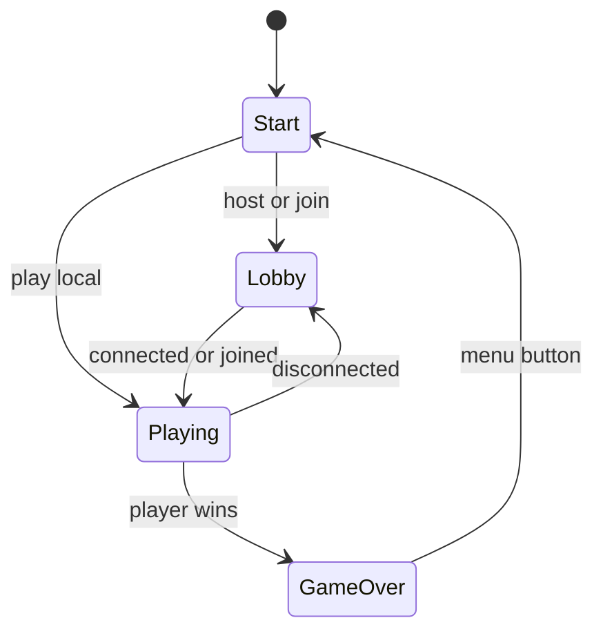
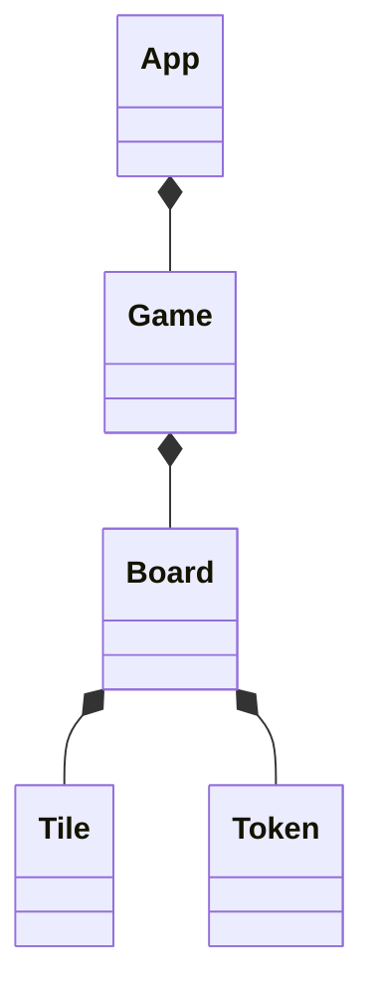

# The Royal Game of Ur

A game to practice using the [Godot engine](https://godotengine.org/) based on the [Royal Game of Ur](https://en.wikipedia.org/wiki/Royal_Game_of_Ur). Below is a description of the application's design.

## State Diagram

These are the potential states the application can be in, representing the screen shown to the user.

<!-- https://mermaid-js.github.io/mermaid/#/stateDiagram -->

## Class Diagram

- `App.gd`
  - Contains app API
  - Instantiates `Game.gd`
- `Game.gd`
  - Contains game state
  - Contains game API
- `Board.gd`
  - Calls game API
  - Calls app API
  - Listens for game signals

<!-- https://mermaid-js.github.io/mermaid/#/classDiagram -->

